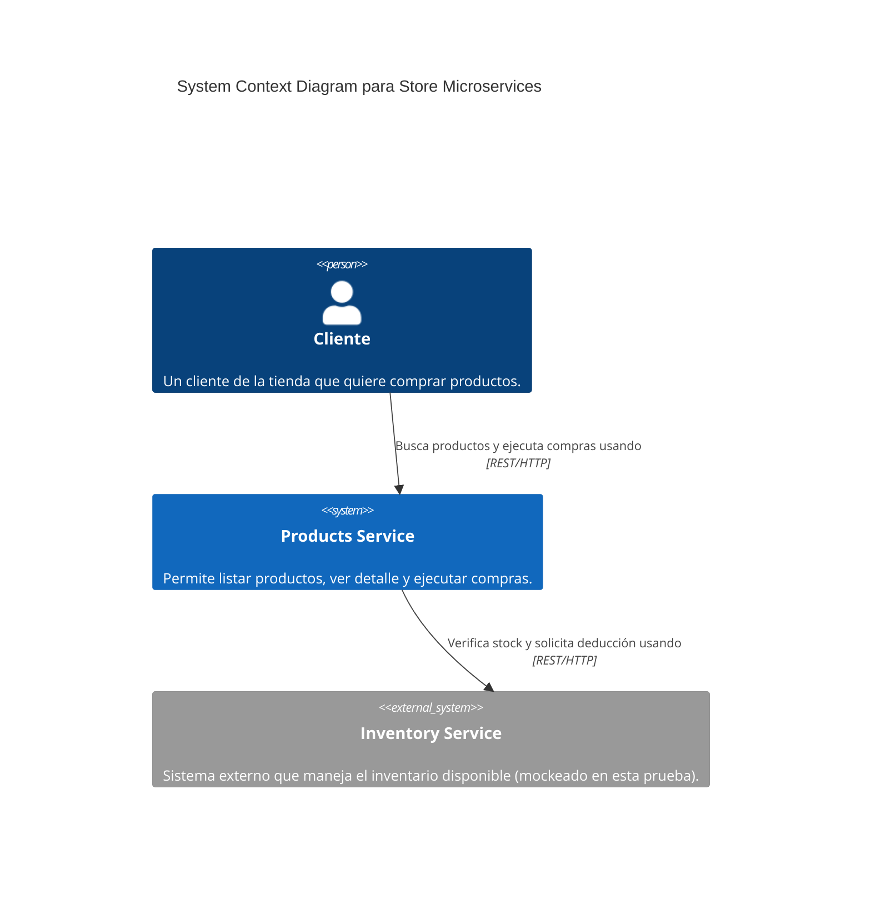
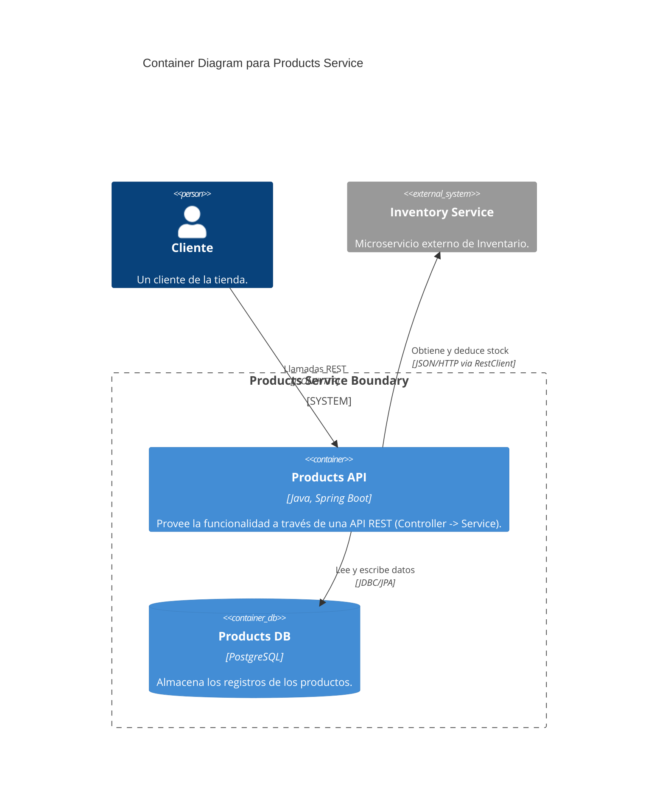

# Diagrama C4 (Nivel 1 y 2)

## C4 Nivel 1: Contexto de Sistema

Este diagrama ilustra a alto nivel cómo el usuario interactúa con nuestro sistema de Microservicios Store, y cómo éste a su vez se comunica con el sistema externo de Inventario.

## C4 Nivel 2: Diagrama de Contenedores

Este diagrama profundiza dentro de nuestro "Products Service" para mostrar sus partes (API, Base de datos).

