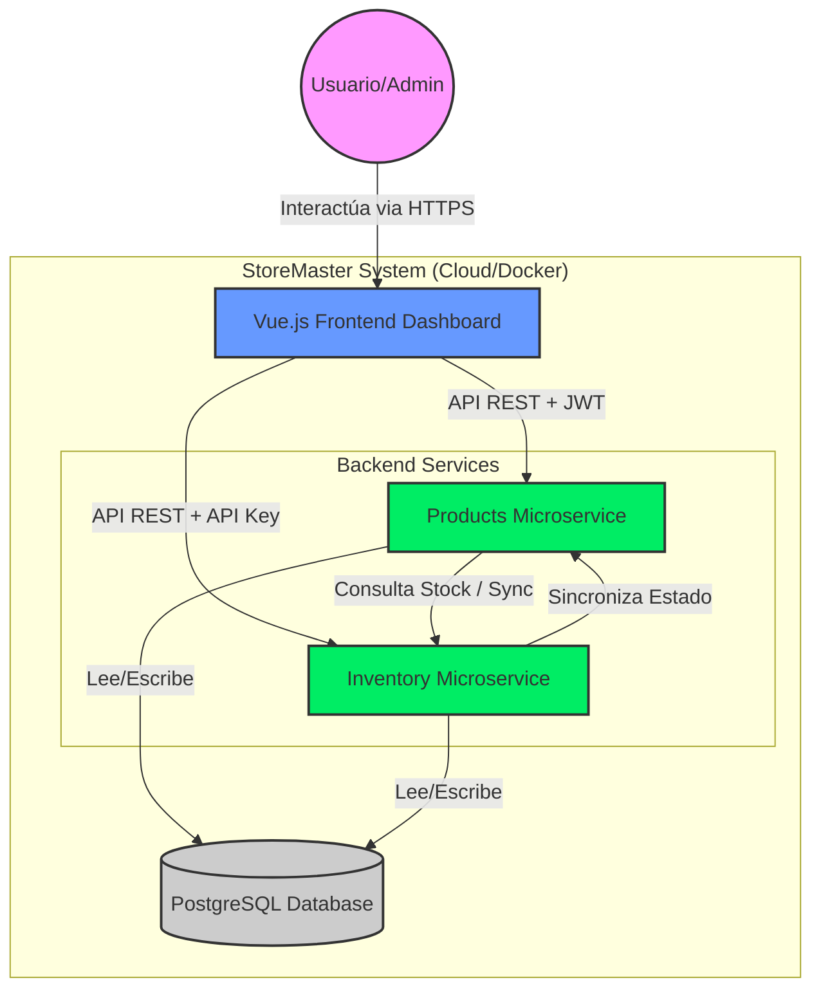

# Arquitectura del Sistema (C4 Nivel 2)

El siguiente diagrama describe la interacción entre los contenedores del sistema StoreMaster, los usuarios y los límites del sistema.

### Componentes principales:
1.  **Frontend Dashboard:** Aplicación SPA que consume los servicios.
2.  **Products Microservice:** Catálogo de productos, autenticación JWT y exposición de APIs
3.  **Inventory Microservice:** Especialista en lógica de almacén y concurrencia.
4.  **Shared Database:** Instancia de PostgreSQL con esquemas separados gestionados por Flyway.
