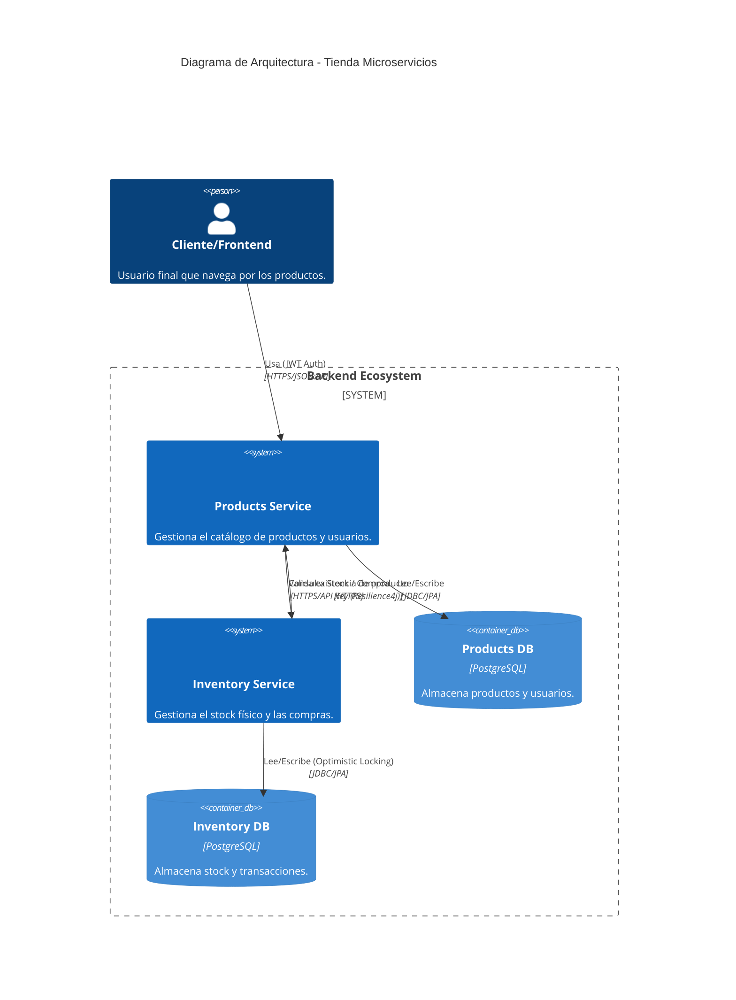

# Arquitectura del Sistema

Este diagrama muestra la arquitectura de los microservicios y sus interacciones.

## Flujos Principales
1. **Autenticación**: El cliente obtiene un JWT mediante `/auth/login`.
2. **Listado**: El cliente solicita `/products`. El servicio consulta su BD y opcionalmente el stock al `Inventory Service`.
3. **Resiliencia**: Si `Inventory Service` está caído, `Products Service` abre su **Circuit Breaker** y responde con un stock degradado sin interrumpir el flujo del catálogo.
